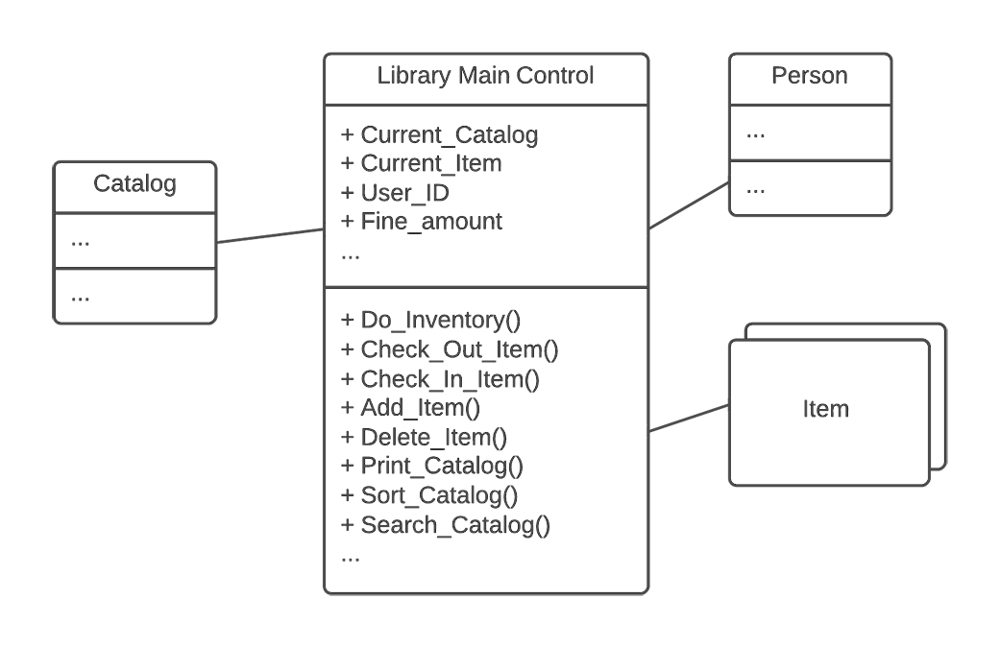

#The Blob
* **AntiPattern Name**: The Blob
* **Also Known A**s: Winnebago and The God Class
* **Most Frequent Scale**: Application
* **Refactored Solution Name**: Refactoring of Responsibilities
* **Refactored Solution Type**: Software
* **Root Causes**: Sloth, Haste
* **Unbalanced Forces**: Management of Functionality, Performance, Complexity
* **Anecdotal Evidence**:
"This is the class that is really the heart of our architecture."

#Background

Do you remember the original black-and-white movie The Blob? Perhaps you saw only the recent remake. In either case, the story line was almost the same: A drip-sized, jellylike alien life form from outer space somehow makes it to Earth.

Whenever the jelly thing eats (usually unsuspecting earthlings), it grows. Meanwhile, incredulous earthlings panic and ignore the one crazy scientist who knows what's happening. Many more people are eaten before they come to their senses. Eventually, the Blob grows so large that it threatens to wipe out the entire planet.

The movie is a good analogy for the Blob AntiPattern, which has been known to consume entire object-oriented architectures.

#General Form

The Blob is found in designs where one class monopolizes the processing, and other classes primarily encapsulate data. This AntiPattern is characterized by a class diagram composed of a single complex controller class surrounded by simple data classes. The key problem here is that the majority of the responsibilities are allocated to a single class.

In general, the Blob is a procedural design even though it may be represented using object notations and implemented in object-oriented languages. A procedural design separates process from data, whereas an object-oriented design merges process and data models, along with partitions.

The Blob contains the majority of the process, and the other objects contain the data. Architectures with the Blob have separated process from data; in other words, they are procedural-style rather than object-oriented architectures.

The Blob can be the result of inappropriate requirements allocation. For example, the Blob may be a software module that is given responsibilities that overlap most other parts of the system for system control or system management.

The Blob is also frequently a result of iterative development where proof-of-concept code evolves over time into a prototype, and eventually, a production system. This is often exacerbated by the use of primarily GUI-centric programming languages, such as Visual Basic, that allow a simple form to evolve its functionality, and therefore purpose, during incremental development or prototyping.

The allocation of responsibilities is not repartitioned during system evolution, so that one module becomes predominant. The Blob is often accompanied by unnecessary code, making it hard to differentiate between the useful functionality of the Blob Class and no-longer-used code (see the Lava Flow AntiPattern).
#Symptoms And Consequences
* Single class with a large number of attributes, operations, or both. A class with 60 or more attributes and operations usually indicates the presence of the Blob
* A disparate collection of unrelated attributes and operations encapsulated in a single class. An overall lack of cohesiveness of the attributes and operations is typical of the Blob.
* A single controller class with associated simple, data-object classes.
* An absence of object-oriented design. A program main loop inside the Blob class associated with relatively passive data objects. The single controller class often nearly encapsulates the applications entire functionality, much like a procedural main program.
* A migrated legacy design that has not been properly refactored into an object-oriented architecture.
* The Blob compromises the inherent advantages of an object-oriented design. For example, The Blob limits the ability to modify the system without affecting the functionality of other encapsulated objects. Modifications to the Blob affect the extensive software within the Blob's encapsulation. Modifications to other objects in the system are also likely to have impact on the Blob's software.
* The Blob Class is typically too complex for reuse and testing. It may be inefficient, or introduce excessive complexity to reuse the Blob for subsets of its functionality.
* The Blob Class may be expensive to load into memory, using excessive resources, even for simple operations.

#Typical Causes

* Lack of an object-oriented architecture. The designers may not have an adequate understanding of object-oriented principles. Alternatively, the team may lack appropriate abstraction skills.
* Lack of (any) architecture. The absence of definition of the system components, their interactions, and the specific use of the selected programming languages. This allows programs to evolve in an ad hoc fashion because the programming languages are used for other than their intended purposes.
* Lack of architecture enforcement. Sometimes this AntiPattern grows accidentally, even after a reasonable architecture was planned. This may be the result of inadequate architectural review as development takes place. This is especially prevalent with development teams new to object orientation.
* Too limited intervention. In iterative projects, developers tend to add little pieces of functionality to existing working classes, rather than add new classes, or revise the class hierarchy for more effective allocation of responsibilities.
* Specified disaster. Sometimes the Blob results from the way requirements are specified. If the requirements dictate a procedural solution, then architectural commitments may be made during requirements analysis that are difficult to change. Defining system architecture as part of requirements analysis is usually inappropriate, and often leads to the Blob AntiPattern, or worse.

#Known Exceptions

The Blob AntiPattern is acceptable when wrapping legacy systems. There is no software partitioning required, just a final layer of code to make the legacy system more accessible.

#Refactored Solution

As with most of the AntiPatterns in this section, the solution involves a form of refactoring. The key is to move behavior away from the Blob. It may be appropriate to reallocate behavior to some of the encapsulated data objects in a way that makes these objects more capable and the Blob less complex. The method for refactoring responsibilities is described as follows:

1. Identify or categorize related attributes and operations according to contracts. These contracts should be cohesive in that they all directly relate to a common focus, behavior, or function within the overall system. For example, a library system architecture diagram is represented with a potential Blob class called LIBRARY.
In the example shown in figure 1, the LIBRARY class encapsulates the sum total of all the system's functionality. Therefore, the first step is to identify cohesive sets of operations and attributes that represent contracts. In this case, we could gather operations related to catalog management, like Sort_Catalog and Search_Catalog. 
We could also identify all operations and attributes related to individual items, such as Print_Item, Delete_Item, and so on.

Fig 1

Fig 2

2. The second step is to look for "natural homes" for these contract-based collections of functionality and then migrate them there. In this example, we gather operations related to catalogs and migrate them from the LIBRARY class and move them to the CATALOG class.
We do the same with operations and attributes related to items, moving them to the ITEM class. This both simplifies the LIBRARY class and makes the ITEM and CATALOG classes more than simple encapsulated data tables. The result is a better object-oriented design.

Fig 3
3. The third step is to remove all "far-coupled," or redundant, indirect associations. In the example, the ITEM class is initially far-coupled to the LIBRARY class in that each item really belongs to a CATALOG, which in turn belongs to a LIBRARY.

4. Next, where appropriate, we migrate associates to derived classes to a common base class. In the example, once the far-coupling has been removed between the LIBRARY and ITEM classes, we need to migrate ITEMs to CATALOGs, as shown in figure 4.

Fig 4
5. Finally, we remove all transient associations, replacing them as appropriate with type specifiers to attributes and operations arguments.
In our example, a Check_Out_Item or a Search_For_Item would be a transient process, and could be moved into a separate transient class with local attributes that establish the specific location or search criteria for a specific instance of a check-out or search.
#Variations

Sometimes, with a system composed of the Blob class and its supporting data objects, too much work has been invested to enable a refactoring of the class architecture. An alternative approach may be available that provides an "80%" solution.

Instead of a bottom-up refactoring of the entire class hierarchy, it may be possible to reduce the Blob class from a controller to a coordinator class. The original Blob class manages the system's functionality; the data classes are extended with some of their own processing.

The data classes operate at the direction of the modified coordinator class. This process may allow the retention of the original class hierarchy, except for the migrations of processing functionality from the Blob class to some of the encapsulated data classes.

Riel identifies two major forms of the Blob AntiPattern. He calls these two forms God Classes: Behavioral Form and Data Form

The Behavioral Form is an object that contains a centralized process that interacts with most other parts of the system. The Data Form is an object that contains shared data used by most other objects in the system. Riel introduces a number of object-oriented heuristics for detect ing and refactoring God Class designs.

#Applicability To Other Viewpoints And Scales

Both architectural and managerial viewpoints play key roles in the initial prevention of the Blob AntiPattern. Avoidance of the Blob may require ongoing policing of the architecture to assure adequate distribution of responsibilities.

It is through an architectural viewpoint that an emerging Blob is recognized. With a mature object-oriented analysis and design process, and an alert manager who understands the design, developers can prevent the cultivation of a Blob.

The most important factor is that, in most cases, it's much less expensive to create appropriate design than to rework design after implementation. Up-front investment in good architecture and team education can ensure a project against the Blob and most other AntiPatterns.

Ask any insurance salesperson, and he or she may tell you that most insurance is purchased after it was needed by people who are poorer but wiser.
#Example

A GUI module that is intended to interface to a processing module gradually takes on the processing functionality of background-processing modules. An example of this is a PowerBuilder screen for customer data entry/retrieval. The screen can:

1. Display data.
2. Edit data.
3. Perform simple type validation. The developer then adds functionality to what was intended to be the decision engine:
    * Complex validation.
    * Algorithms that use the validated data to assess next actions.
4. The developer then gets new requirements to:
    * Extend the GUI to three forms.
    * Make it script-driven (including the development of a script engine).
    * Add new algorithms to the decision engine.

The developer extends the current module to incorporate all of this functionality. So instead of developing several modules, a single module is developed. If the intended application is architected and designed, it is easier to maintain and extend.

