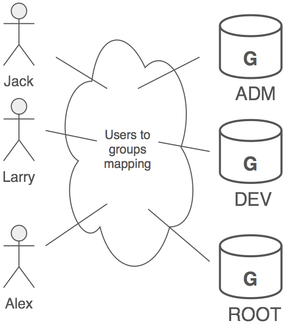
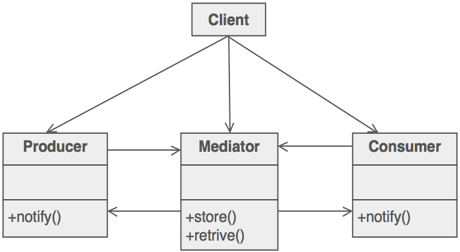
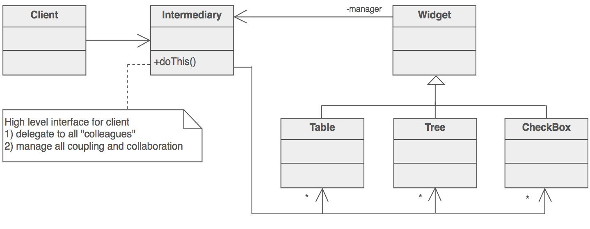
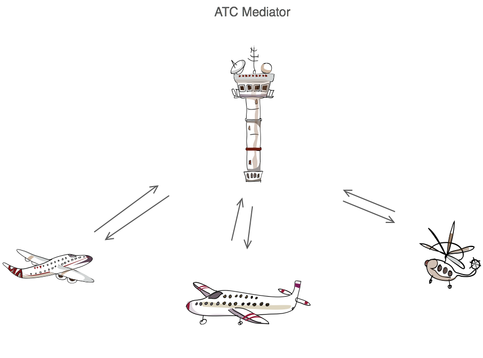

#Mediator Design Pattern
##Intent

* Define an object that encapsulates how a set of objects interact. Mediator promotes loose coupling by keeping objects from referring to each other explicitly, and it lets you vary their interaction independently.
* Design an intermediary to decouple many peers.
* Promote the many-to-many relationships between interacting peers to "full object status".
##Problem

We want to design reusable components, but dependencies between the potentially reusable pieces demonstrates the "spaghetti code" phenomenon (trying to scoop a single serving results in an "all or nothing clump").

##Discussion

In Unix, permission to access system resources is managed at three levels of granularity: world, group, and owner. A group is a collection of users intended to model some functional affiliation. Each user on the system can be a member of one or more groups, and each group can have zero or more users assigned to it. Next figure shows three users that are assigned to all three groups.

If we were to model this in software, we could decide to have User objects coupled to Group objects, and Group objects coupled to User objects. Then when changes occur, both classes and all their instances would be affected.

An alternate approach would be to introduce "an additional level of indirection" - take the mapping of users to groups and groups to users, and make it an abstraction unto itself. This offers several advantages: Users and Groups are decoupled from one another, many mappings can easily be maintained and manipulated simultaneously, and the mapping abstraction can be extended in the future by defining derived classes.


Partitioning a system into many objects generally enhances reusability, but proliferating interconnections between those objects tend to reduce it again. The mediator object: encapsulates all interconnections, acts as the hub of communication, is responsible for controlling and coordinating the interactions of its clients, and promotes loose coupling by keeping objects from referring to each other explicitly.

The Mediator pattern promotes a "many-to-many relationship network" to "full object status". Modelling the inter-relationships with an object enhances encapsulation, and allows the behavior of those inter-relationships to be modified or extended through subclassing.

An example where Mediator is useful is the design of a user and group capability in an operating system. A group can have zero or more users, and, a user can be a member of zero or more groups. The Mediator pattern provides a flexible and non-invasive way to associate and manage users and groups.

##Structure

Colleagues (or peers) are not coupled to one another. Each talks to the Mediator, which in turn knows and conducts the orchestration of the others. The "many to many" mapping between colleagues that would otherwise exist, has been "promoted to full object status". This new abstraction provides a locus of indirection where additional leverage can be hosted.


##Example

The Mediator defines an object that controls how a set of objects interact. Loose coupling between colleague objects is achieved by having colleagues communicate with the Mediator, rather than with each other. The control tower at a controlled airport demonstrates this pattern very well. The pilots of the planes approaching or departing the terminal area communicate with the tower rather than explicitly communicating with one another. The constraints on who can take off or land are enforced by the tower. It is important to note that the tower does not control the whole flight. It exists only to enforce constraints in the terminal area.

##Check list
1. Identify a collection of interacting objects that would benefit from mutual decoupling.
2. Encapsulate those interactions in the abstraction of a new class.
3. Create an instance of that new class and rework all "peer" objects to interact with the Mediator only.
4. Balance the principle of decoupling with the principle of distributing responsibility evenly.
4. Be careful not to create a "controller" or "god" object.

##Rules

* Chain of Responsibility, Command, Mediator, and Observer, address how you can decouple senders and receivers, but with different trade-offs. Chain of Responsibility passes a sender request along a chain of potential receivers. Command normally specifies a sender-receiver connection with a subclass. Mediator has senders and receivers reference each other indirectly. Observer defines a very decoupled interface that allows for multiple receivers to be configured at run-time.
* Mediator and Observer are competing patterns. The difference between them is that Observer distributes communication by introducing "observer" and "subject" objects, whereas a Mediator object encapsulates the communication between other objects. We've found it easier to make reusable Observers and Subjects than to make reusable Mediators.
* On the other hand, Mediator can leverage Observer for dynamically registering colleagues and communicating with them.
* Mediator is similar to Facade in that it abstracts functionality of existing classes. Mediator abstracts/centralizes arbitrary communication between colleague objects, it routinely "adds value", and it is known/referenced by the colleague objects (i.e. it defines a multidirectional protocol). In contrast, Facade defines a simpler interface to a subsystem, it doesn't add new functionality, and it is not known by the subsystem classes (i.e. it defines a unidirectional protocol where it makes requests of the subsystem classes but not vice versa).


##Code
An object passes all interaction between a number of other objects through itself.

In this example, BookMediator is notified by BookAuthorColleague or BookTitleColleague if they change to all upper case or all lower case. When either changes case, BookMediator calls the other to change it's case to match.

```php
<?php

class BookMediator {
    private $authorObject;
    private $titleObject;
    function __construct($author_in, $title_in) {
      $this->authorObject = new BookAuthorColleague($author_in,$this);
      $this->titleObject  = new BookTitleColleague($title_in,$this);
    }
    function getAuthor() {return $this->authorObject;}
    function getTitle() {return $this->titleObject;}
    // when title or author change case, this makes sure the other
    // stays in sync
    function change(BookColleague $changingClassIn) {
      if ($changingClassIn instanceof BookAuthorColleague) {
        if ('upper' == $changingClassIn->getState()) {
          if ('upper' != $this->getTitle()->getState()) {
            $this->getTitle()->setTitleUpperCase();
          }
        } elseif ('lower' == $changingClassIn->getState()) {
          if ('lower' != $this->getTitle()->getState()) {
            $this->getTitle()->setTitleLowerCase();
          }
        }
      } elseif ($changingClassIn instanceof BookTitleColleague) {
        if ('upper' == $changingClassIn->getState()) {
          if ('upper' != $this->getAuthor()->getState()) {
            $this->getAuthor()->setAuthorUpperCase();
          }
        } elseif ('lower' == $changingClassIn->getState()) {
          if ('lower' != $this->getAuthor()->getState()) {
            $this->getAuthor()->setAuthorLowerCase();
          }
        }
      }
    }
}

abstract class BookColleague {
    private $mediator;
    function __construct($mediator_in) {
        $this->mediator = $mediator_in;
    }
    function getMediator() {return $this->mediator;}
    function changed($changingClassIn) {
        getMediator()->titleChanged($changingClassIn);
    }
}

class BookAuthorColleague extends BookColleague {
    private $author;
    private $state;
    function __construct($author_in, $mediator_in) {
      $this->author = $author_in;
      parent::__construct($mediator_in);
    }
    function getAuthor() {return $this->author;}
    function setAuthor($author_in) {$this->author = $author_in;}
    function getState() {return $this->state;}
    function setState($state_in) {$this->state = $state_in;}
    function setAuthorUpperCase() {
      $this->setAuthor(strtoupper($this->getAuthor()));
      $this->setState('upper');
      $this->getMediator()->change($this);
    }
    function setAuthorLowerCase() {
      $this->setAuthor(strtolower($this->getAuthor()));
      $this->setState('lower');
      $this->getMediator()->change($this);
    }
}

class BookTitleColleague extends BookColleague {
    private $title;
    private $state;
    function __construct($title_in, $mediator_in) {
        $this->title = $title_in;
        parent::__construct($mediator_in);
    }
    function getTitle() {return $this->title;}
    function setTitle($title_in) {$this->title = $title_in;}
    function getState() {return $this->state;}
    function setState($state_in) {$this->state = $state_in;}
    function setTitleUpperCase() {
        $this->setTitle(strtoupper($this->getTitle()));
        $this->setState('upper');
        $this->getMediator()->change($this);
    }
    function setTitleLowerCase() {
        $this->setTitle(strtolower($this->getTitle()));
        $this->setState('lower');
        $this->getMediator()->change($this);
    }
}
 
  writeln('BEGIN TESTING MEDIATOR PATTERN');
  writeln('');

  $mediator = new BookMediator('Gamma, Helm, Johnson, and Vlissides', 'Design Patterns');
 
  $author = $mediator->getAuthor();
  $title = $mediator->getTitle();
 
  writeln('Original Author and Title: ');
  writeln('author: ' . $author->getAuthor());
  writeln('title: ' . $title->getTitle());
  writeln('');
 
  $author->setAuthorLowerCase();
 
  writeln('After Author set to Lower Case: ');
  writeln('author: ' . $author->getAuthor());
  writeln('title: ' . $title->getTitle());
  writeln('');

  $title->setTitleUpperCase();
 
  writeln('After Title set to Upper Case: ');
  writeln('author: ' . $author->getAuthor());
  writeln('title: ' . $title->getTitle());
  writeln('');
 
  writeln('END TESTING MEDIATOR PATTERN');

  function writeln($line_in) {
    echo $line_in.'<br/>';
  }

?>
```
##Output

```
BEGIN TESTING MEDIATOR PATTERN

Original Author and Title: 
author: Gamma, Helm, Johnson, and Vlissides
title: Design Patterns

After Author set to Lower Case: 
author: gamma, helm, johnson, and vlissides
title: design patterns

After Title set to Upper Case: 
author: GAMMA, HELM, JOHNSON, AND VLISSIDES
title: DESIGN PATTERNS

END TESTING MEDIATOR PATTERN
```