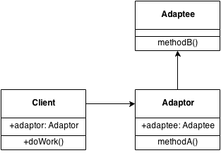

Adapter pattern is a structural software design pattern that allows the interface of some class to be used in another interface.

Example:

```php

```

UML diagram:



Resources:

* [Wikipedia](http://en.wikipedia.org/wiki/Adapter_pattern)
